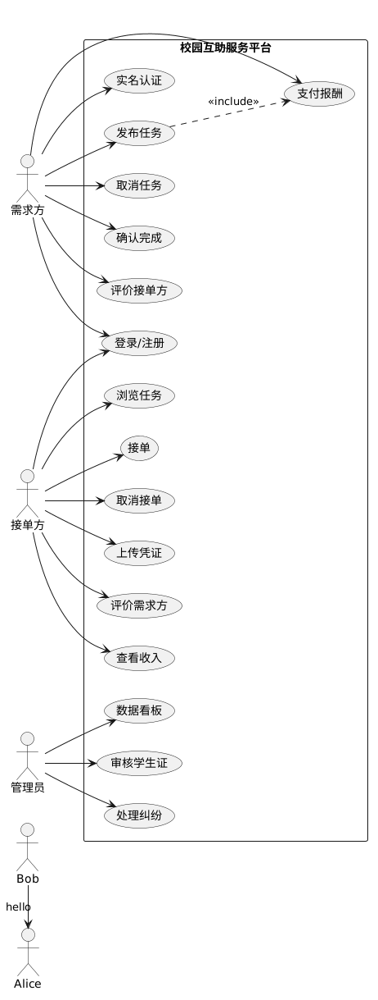

**核心用例描述：**
---
**用例 1：发布任务**

用例编号	UC-01

用例名称	发布任务

参与者	需求方

前置条件	
1. 用户已登录并通过实名认证（学生证审核通过）
2. 信用分 ≥ 60（若信用分过低则禁止发布）

后置条件	
1. 任务进入“发布中”列表，其他用户可见
2. 若为现金任务，需求方账户被冻结相应金额（托管）
   基本流
   需求方进入“发布任务”页面。

系统显示任务类型选项：快递代取、学习辅导、二手交易、组队匹配、其他。

需求方选择类型，填写标题、详细描述、报酬（元或积分）、截止时间、地点（支持地图选点）。

若类型为“快递代取”，系统要求上传取件码/快递单号照片（可多张）。

需求方点击“发布”。

系统校验：

标题/描述不含敏感词

报酬金额 ≤ 账户余额（现金）或积分足够

地点在校园范围内

校验通过后，系统生成任务订单，状态为“发布中”。

系统向可能感兴趣的接单方发送推送通知（可选）。

用例结束。

**【替代流】**
A1 敏感词触发：步骤 6 检测到违规内容 → 系统提示“包含违规词，请修改” → 返回步骤 3。

A2 余额不足：现金任务但账户余额 < 报酬金额 → 系统提示“余额不足，请充值” → 用例终止。

A3 信用分不足：信用分 < 60 → 系统提示“信用分过低，暂时无法发布” → 用例终止。

A4 用户取消发布：步骤 5 之前点击取消 → 返回首页，不生成订单。

**用例 2：接单并完成任务**

用例编号	UC-02

用例名称	接单并完成任务

参与者	接单方

前置条件	
1. 接单方已登录并通过实名认证
2. 存在至少一个“发布中”状态的任务
3. 接单方信用分 ≥ 50

后置条件	
1. 订单状态变为“已完成”
2. 接单方收到报酬（现金入账或积分增加）
3. 双方可互评

【基本流】
接单方进入任务列表，通过筛选/搜索找到目标任务。

点击任务卡片查看详情（包括报酬、地点、截止时间）。

接单方点击“接单”。

系统检查：

任务仍为“发布中”状态（未被他人接走）

接单方不是该任务的需求方本人

校验通过，订单状态变更为“已接单”。

双方通过系统内聊天（或预留联系方式）沟通具体细节。

接单方完成任务（如取到快递、辅导完功课）。

接单方进入“我的订单” → 进行中订单 → 点击“上传凭证”，上传照片/文字证明。

订单状态变更为“待确认”。

需求方确认完成（或用例 UC-01 中的自动确认机制）。

系统将报酬打给接单方（现金扣除手续费后到账，积分实时增加）。

订单状态变更为“已完成”。

用例结束。

【替代流】

A1 任务已被接走：步骤 3 时任务已被其他用户接单 → 系统提示“该任务已被接单” → 刷新列表。

A2 接单方信用分不足：步骤 3 时信用分 < 50 → 系统提示“信用分过低，无法接单” → 用例终止。

A3 接单方取消接单：在步骤 6 后但未完成前，接单方点击“取消” → 系统扣除接单方 5 分信用分 → 订单状态回到“发布中”。

A4 需求方拒绝完成：需求方认为任务未达标并拒绝确认 → 进入纠纷流程（用例 3）。

**用例 3：处理纠纷**

用例编号	UC-03
用例名称	处理纠纷
参与者	管理员（主要）、需求方、接单方（次要）
前置条件	
1. 订单状态为“待确认”或“进行中”
2. 需求方或接单方发起申诉/投诉

后置条件	
1. 订单被强制完成 / 取消 / 退款
2. 违规方被扣除信用分或封禁
3. 纠纷记录被存档

【基本流】

需求方或接单方在订单详情页点击“申诉/投诉”。

系统要求填写申诉原因、上传证据（聊天截图、凭证照片）。

提交后，订单状态变更为“纠纷中”，双方暂时无法操作。

管理员在后台“纠纷列表”看到新申诉。

管理员查看双方提交的证据以及订单历史记录。

管理员做出裁决：

若接单方未完成任务 → 取消订单，退款给需求方，扣除接单方信用分 10 分

若需求方无理拒绝确认 → 强制完成订单，打款给接单方，扣除需求方信用分 10 分

若双方都有过错 → 各扣除 5 分，订单取消，按比例退款

系统向双方发送裁决结果通知。

订单状态变更为“已关闭（纠纷结案）”。

用例结束。

【替代流】

A1 证据不足：步骤 5 时管理员无法判断 → 联系双方补充材料，等待 48 小时 → 超时未补则按“证据不足，维持原状态”处理（订单回到纠纷前状态）。

A2 违规严重：步骤 6 发现用户多次恶意纠纷 → 管理员直接封禁用户 30 天。

A3 申诉撤销：在管理员裁决前，申诉方可主动撤销申诉 → 订单回到纠纷前状态，不扣分。

