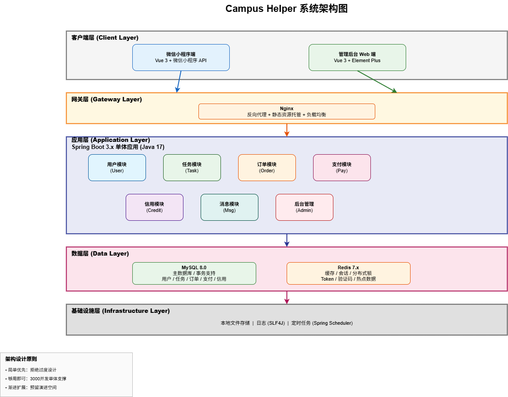
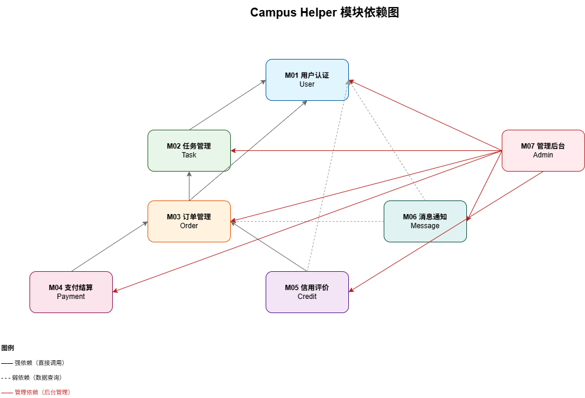

# Campus Helper 架构设计文档

**团队名称**：哪一队  
**日期**：2026-04-28  
**文档版本**：V1.0

---

## 一、架构概览

### 1.1 架构风格

**前后端分离 + 分层单体架构（Layered Monolith）**

基于"架构辩论赛"团队决策，本系统采用前后端分离的分层单体架构，满足10周交付、4人团队、单校3000并发的约束条件。

### 1.2 架构图

---

## 二、模块划分说明

基于 Phase 1 需求规格说明书，系统划分为7个业务模块：

| 模块编号 | 模块名称   | 英文标识      | 优先级 |
|------|--------|-----------|-----|
| M01  | 用户认证模块 | `user`    | P0  |
| M02  | 任务管理模块 | `task`    | P0  |
| M03  | 订单管理模块 | `order`   | P0  |
| M04  | 支付结算模块 | `payment` | P0  |
| M05  | 信用评价模块 | `credit`  | P0  |
| M06  | 消息通知模块 | `message` | P1  |
| M07  | 管理后台模块 | `admin`   | P0  |

### 2.1 各模块职责边界

**M01 用户认证模块 (`user`)**

- 手机号注册登录（短信验证码 + JWT Token）
- 实名认证（学生证照片上传，后台人工审核）
- 个人信息管理（昵称、头像、宿舍楼地址）
- 信用分展示（信用分、完成单数、好评率）

**M02 任务管理模块 (`task`)**

- 任务发布（快递代取/二手交易/组队匹配/学习辅导/其他）
- 任务浏览（列表展示，支持类型/距离/报酬/时间筛选排序）
- 任务详情查看
- 接单操作（同一任务只能被一人接单）
- 快递代取特殊处理（取件码照片，仅接单方可见）

**M03 订单管理模块 (`order`)**

- 订单状态机管理：发布中 → 已接单 → 进行中 → 待确认 → 已完成/已取消
- 取消订单（取消方扣除5分信用分，30天内≥3次限制接单7天）
- 完成确认（接单方上传凭证，需求方确认；2天未确认自动完成）
- 纠纷申诉处理

**M04 支付结算模块 (`payment`)**

- 报酬托管（需求方预付，平台冻结）
- 自动打款（订单完成后扣除5%手续费，转入接单方账户）
- 积分管理（获取、消费，不可提现）
- 收入明细查询、退款处理

**M05 信用评价模块 (`credit`)**

- 信用分计算（基于订单完成率、取消次数、评价，0-100分）
- 互评系统（1-5星 + 文字评价，7天内可追评）
- 等级标签（优秀/良好/一般/受限）
- 信用分变动记录

**M06 消息通知模块 (`message`)**

- 站内通知（订单状态变更、审核结果、系统公告）
- 订单留言（任务详情页简单文字沟通，非实时IM）

**M07 管理后台模块 (`admin`)**

- 用户管理（查看、封禁、信用分调整）
- 订单管理（查看、手动调整状态、纠纷处理）
- 实名审核（学生证照片通过/拒绝）
- 内容审核（敏感词管理、违规内容查看）
- 数据看板（日活、订单量、类型占比、投诉率）

---

## 三、模块依赖图

### 3.1 模块间依赖关系

### 3.2 依赖关系说明

| 依赖方向      | 说明                  |
|-----------|---------------------|
| M02 → M01 | 任务发布/接单需校验用户认证状态    |
| M03 → M02 | 订单基于任务创建            |
| M03 → M01 | 订单关联需求方和接单方用户       |
| M04 → M03 | 支付基于订单创建，跟随订单状态流转   |
| M05 → M03 | 信用分计算基于订单完成/取消/评价数据 |
| M06 → M03 | 订单状态变更触发通知          |
| M07 → ALL | 后台管理所有模块数据          |

---

## 四、模块接口定义

### 4.1 接口设计规范

| 规范项    | 说明                                                  |
|--------|-----------------------------------------------------|
| 协议     | HTTP/1.1 + RESTful                                  |
| 数据格式   | JSON (Content-Type: application/json)               |
| 认证方式   | JWT Token (Bearer Token)                            |
| 统一响应格式 | `{ "code": 200, "message": "success", "data": {} }` |

### 4.2 核心模块接口

#### M01 用户认证模块

| 接口     | 方法   | 路径                       |
|--------|------|--------------------------|
| 发送验证码  | POST | `/api/auth/sms`          |
| 登录/注册  | POST | `/api/auth/login`        |
| 上传学生证  | POST | `/api/auth/student-card` |
| 获取用户信息 | GET  | `/api/user/info`         |
| 更新用户信息 | PUT  | `/api/user/info`         |

#### M02 任务管理模块

| 接口   | 方法   | 路径                       |
|------|------|--------------------------|
| 发布任务 | POST | `/api/tasks`             |
| 任务列表 | GET  | `/api/tasks`             |
| 任务详情 | GET  | `/api/tasks/{id}`        |
| 接单   | POST | `/api/tasks/{id}/accept` |
| 取消任务 | PUT  | `/api/tasks/{id}/cancel` |

#### M03 订单管理模块

| 接口     | 方法   | 路径                          |
|--------|------|-----------------------------|
| 获取订单列表 | GET  | `/api/orders`               |
| 获取订单详情 | GET  | `/api/orders/{id}`          |
| 上传完成凭证 | POST | `/api/orders/{id}/evidence` |
| 确认完成   | PUT  | `/api/orders/{id}/confirm`  |
| 取消订单   | PUT  | `/api/orders/{id}/cancel`   |

#### M04 支付结算模块

| 接口     | 方法  | 路径                     |
|--------|-----|------------------------|
| 查询余额   | GET | `/api/payment/balance` |
| 查询收入明细 | GET | `/api/payment/income`  |
| 查询积分   | GET | `/api/payment/points`  |

#### M05 信用评价模块

| 接口      | 方法   | 路径                           |
|---------|------|------------------------------|
| 提交评价    | POST | `/api/reviews`               |
| 获取评价列表  | GET  | `/api/reviews/user/{userId}` |
| 获取信用分记录 | GET  | `/api/credit/logs`           |

#### M06 消息通知模块

| 接口     | 方法  | 路径                                |
|--------|-----|-----------------------------------|
| 获取通知列表 | GET | `/api/notifications`              |
| 标记已读   | PUT | `/api/notifications/{id}/read`    |
| 获取未读数量 | GET | `/api/notifications/unread-count` |

#### M07 管理后台模块

| 接口    | 方法   | 路径                             |
|-------|------|--------------------------------|
| 管理员登录 | POST | `/api/admin/login`             |
| 用户列表  | GET  | `/api/admin/users`             |
| 审核学生证 | PUT  | `/api/admin/users/{id}/auth`   |
| 订单列表  | GET  | `/api/admin/orders`            |
| 调整信用分 | PUT  | `/api/admin/users/{id}/credit` |
| 敏感词管理 | CRUD | `/api/admin/sensitive-words`   |

---

## 五、技术选型说明

| 层次    | 选择                        | 选择理由                     |
|-------|---------------------------|--------------------------|
| 前端框架  | Vue 3 + Vite              | 组合式API逻辑清晰，构建速度快         |
| 前端UI库 | Element Plus              | 管理后台组件丰富，文档完善            |
| 状态管理  | Pinia                     | Vue官方推荐，TypeScript支持好    |
| 后端框架  | Spring Boot 3.x + Java 17 | 生态成熟，自动配置，LTS版本          |
| ORM框架 | MyBatis-Plus              | 简化CRUD，代码生成器，复杂SQL可控     |
| 数据库   | MySQL 8.0                 | 关系型数据，ACID事务支持，适合订单/支付场景 |
| 缓存    | Redis 7.x                 | 会话存储、验证码、分布式锁、热点数据缓存     |
| 安全框架  | Spring Security           | 与Spring Boot深度集成，JWT支持完善 |
| API文档 | SpringDoc OpenAPI         | 自动生成Swagger UI，前后端协作效率高  |
| 定时任务  | Spring Scheduler          | 内置支持，实现订单超时取消，无需额外中间件    |
| 文件存储  | 本地文件系统                    | 10周项目够用，零配置，省去OSS学习成本    |
| 版本控制  | Git                       | 团队协作标准工具                 |
| 部署方式  | Docker Compose + 阿里云ECS   | 单文件定义多容器，一键启动；学生优惠99元/年  |

---

**文档编制**：罗昕雅（架构负责人）  
**审核状态**：已定稿