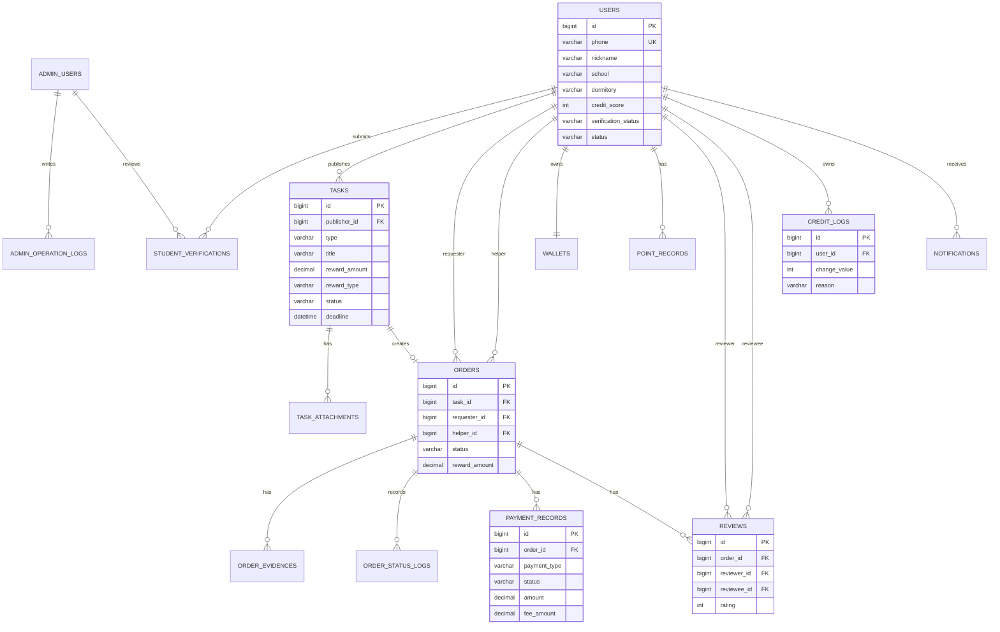

# P3 ER 图与建表 SQL

> 项目：Campus Helper 校园互助服务平台  
> 数据库：MySQL 8.x  
> ORM：MyBatis-Plus  
> 设计目标：支撑用户认证、任务发布、接单、订单流转、托管支付、信用评价和后台审核等 P0 核心功能。

---

## 1. 数据库设计原则

1. 核心业务表按模块拆分：用户、任务、订单、支付、信用评价、消息、后台管理。
2. 主键统一使用 `BIGINT AUTO_INCREMENT`，便于 MyBatis-Plus 映射。
3. 状态字段使用 `VARCHAR(32)`，由应用层枚举控制，便于后续扩展状态。
4. 文件类数据仅保存 URL 或对象存储 Key，不在数据库中保存图片二进制内容。
5. 手机号等隐私字段限制访问，展示时脱敏；管理员密码使用哈希值保存，不保存明文。
6. 常用查询条件建立索引，例如任务状态、任务类型、订单双方用户、订单状态、评价对象等。

---

## 2. ER 图



---

## 3. 建表 SQL

> 说明：以下 SQL 可直接在 MySQL 8.x 执行。若开发环境使用 H2，需要按 H2 方言调整 `COMMENT`、`ENGINE` 等语法。

```text
CREATE DATABASE IF NOT EXISTS campus_helper
  DEFAULT CHARACTER SET utf8mb4
  DEFAULT COLLATE utf8mb4_unicode_ci;

USE campus_helper;

-- 1. 普通用户表
CREATE TABLE users (
    id BIGINT PRIMARY KEY AUTO_INCREMENT,
    phone VARCHAR(20) NOT NULL COMMENT '手机号，登录账号，展示时需要脱敏',
    nickname VARCHAR(50) NOT NULL DEFAULT '校园用户' COMMENT '昵称',
    avatar_url VARCHAR(255) NULL COMMENT '头像URL',
    school VARCHAR(100) NOT NULL COMMENT '学校',
    dormitory VARCHAR(100) NULL COMMENT '宿舍楼/地址',
    credit_score INT NOT NULL DEFAULT 100 COMMENT '信用分，0-100',
    completed_order_count INT NOT NULL DEFAULT 0 COMMENT '完成订单数',
    good_review_rate DECIMAL(5,4) NOT NULL DEFAULT 0.0000 COMMENT '好评率，例如0.9800',
    verification_status VARCHAR(32) NOT NULL DEFAULT 'UNSUBMITTED' COMMENT 'UNSUBMITTED/PENDING/APPROVED/REJECTED',
    status VARCHAR(32) NOT NULL DEFAULT 'NORMAL' COMMENT 'NORMAL/BANNED/RESTRICTED',
    created_at DATETIME NOT NULL DEFAULT CURRENT_TIMESTAMP,
    updated_at DATETIME NOT NULL DEFAULT CURRENT_TIMESTAMP ON UPDATE CURRENT_TIMESTAMP,
    deleted TINYINT NOT NULL DEFAULT 0 COMMENT '逻辑删除标记',
    UNIQUE KEY uk_users_phone (phone),
    KEY idx_users_school_status (school, status),
    KEY idx_users_verification_status (verification_status)
) ENGINE=InnoDB DEFAULT CHARSET=utf8mb4 COMMENT='普通用户表';

-- 2. 学生认证申请表
CREATE TABLE student_verifications (
    id BIGINT PRIMARY KEY AUTO_INCREMENT,
    user_id BIGINT NOT NULL COMMENT '申请用户ID',
    student_no VARCHAR(50) NOT NULL COMMENT '学号',
    student_card_image_url VARCHAR(255) NOT NULL COMMENT '学生证照片URL/对象存储Key',
    status VARCHAR(32) NOT NULL DEFAULT 'PENDING' COMMENT 'PENDING/APPROVED/REJECTED',
    reviewer_id BIGINT NULL COMMENT '审核管理员ID',
    reject_reason VARCHAR(255) NULL COMMENT '拒绝原因',
    submitted_at DATETIME NOT NULL DEFAULT CURRENT_TIMESTAMP,
    reviewed_at DATETIME NULL,
    created_at DATETIME NOT NULL DEFAULT CURRENT_TIMESTAMP,
    updated_at DATETIME NOT NULL DEFAULT CURRENT_TIMESTAMP ON UPDATE CURRENT_TIMESTAMP,
    KEY idx_verifications_user_id (user_id),
    KEY idx_verifications_status (status),
    KEY idx_verifications_reviewer_id (reviewer_id),
    CONSTRAINT fk_verifications_user FOREIGN KEY (user_id) REFERENCES users(id)
) ENGINE=InnoDB DEFAULT CHARSET=utf8mb4 COMMENT='学生认证申请表';

-- 3. 管理员账号表
CREATE TABLE admin_users (
    id BIGINT PRIMARY KEY AUTO_INCREMENT,
    username VARCHAR(50) NOT NULL COMMENT '管理员用户名',
    password_hash VARCHAR(255) NOT NULL COMMENT '密码哈希，禁止保存明文密码',
    role VARCHAR(32) NOT NULL DEFAULT 'OPERATOR' COMMENT 'SUPER_ADMIN/OPERATOR/AUDITOR',
    status VARCHAR(32) NOT NULL DEFAULT 'NORMAL' COMMENT 'NORMAL/DISABLED',
    created_at DATETIME NOT NULL DEFAULT CURRENT_TIMESTAMP,
    updated_at DATETIME NOT NULL DEFAULT CURRENT_TIMESTAMP ON UPDATE CURRENT_TIMESTAMP,
    UNIQUE KEY uk_admin_users_username (username)
) ENGINE=InnoDB DEFAULT CHARSET=utf8mb4 COMMENT='管理员账号表';

ALTER TABLE student_verifications
    ADD CONSTRAINT fk_verifications_reviewer FOREIGN KEY (reviewer_id) REFERENCES admin_users(id);

-- 4. 任务表
CREATE TABLE tasks (
    id BIGINT PRIMARY KEY AUTO_INCREMENT,
    publisher_id BIGINT NOT NULL COMMENT '发布者用户ID',
    type VARCHAR(32) NOT NULL COMMENT 'EXPRESS/TUTORING/MATERIAL_SHARE/LOST_FOUND/SECOND_HAND/TEAM_UP/OTHER',
    title VARCHAR(100) NOT NULL COMMENT '任务标题',
    description TEXT NOT NULL COMMENT '任务描述',
    reward_amount DECIMAL(10,2) NOT NULL DEFAULT 0.00 COMMENT '报酬金额',
    reward_type VARCHAR(32) NOT NULL DEFAULT 'CASH' COMMENT 'CASH/POINT',
    location VARCHAR(255) NOT NULL COMMENT '任务地点',
    deadline DATETIME NOT NULL COMMENT '截止时间',
    status VARCHAR(32) NOT NULL DEFAULT 'PUBLISHED' COMMENT 'PUBLISHED/ACCEPTED/CANCELLED/CLOSED',
    created_at DATETIME NOT NULL DEFAULT CURRENT_TIMESTAMP,
    updated_at DATETIME NOT NULL DEFAULT CURRENT_TIMESTAMP ON UPDATE CURRENT_TIMESTAMP,
    deleted TINYINT NOT NULL DEFAULT 0,
    KEY idx_tasks_publisher_id (publisher_id),
    KEY idx_tasks_status_type_created (status, type, created_at),
    KEY idx_tasks_reward_amount (reward_amount),
    KEY idx_tasks_deadline (deadline),
    FULLTEXT KEY ft_tasks_title_description (title, description),
    CONSTRAINT fk_tasks_publisher FOREIGN KEY (publisher_id) REFERENCES users(id)
) ENGINE=InnoDB DEFAULT CHARSET=utf8mb4 COMMENT='任务表';

-- 5. 任务附件表
CREATE TABLE task_attachments (
    id BIGINT PRIMARY KEY AUTO_INCREMENT,
    task_id BIGINT NOT NULL,
    file_url VARCHAR(255) NOT NULL COMMENT '附件URL/对象存储Key',
    visible_to_helper_only TINYINT NOT NULL DEFAULT 0 COMMENT '是否仅接单方可见',
    created_at DATETIME NOT NULL DEFAULT CURRENT_TIMESTAMP,
    KEY idx_task_attachments_task_id (task_id),
    CONSTRAINT fk_task_attachments_task FOREIGN KEY (task_id) REFERENCES tasks(id)
) ENGINE=InnoDB DEFAULT CHARSET=utf8mb4 COMMENT='任务附件表';

-- 6. 订单表
CREATE TABLE orders (
    id BIGINT PRIMARY KEY AUTO_INCREMENT,
    task_id BIGINT NOT NULL COMMENT '任务ID',
    requester_id BIGINT NOT NULL COMMENT '需求方用户ID',
    helper_id BIGINT NOT NULL COMMENT '接单方用户ID',
    status VARCHAR(32) NOT NULL DEFAULT 'ACCEPTED' COMMENT 'ACCEPTED/IN_PROGRESS/PENDING_CONFIRM/COMPLETED/CANCELLED',
    reward_amount DECIMAL(10,2) NOT NULL COMMENT '订单报酬金额',
    accepted_at DATETIME NOT NULL DEFAULT CURRENT_TIMESTAMP,
    completed_at DATETIME NULL,
    cancel_reason VARCHAR(255) NULL,
    created_at DATETIME NOT NULL DEFAULT CURRENT_TIMESTAMP,
    updated_at DATETIME NOT NULL DEFAULT CURRENT_TIMESTAMP ON UPDATE CURRENT_TIMESTAMP,
    UNIQUE KEY uk_orders_task_id (task_id),
    KEY idx_orders_requester_status (requester_id, status),
    KEY idx_orders_helper_status (helper_id, status),
    KEY idx_orders_status_updated (status, updated_at),
    CONSTRAINT fk_orders_task FOREIGN KEY (task_id) REFERENCES tasks(id),
    CONSTRAINT fk_orders_requester FOREIGN KEY (requester_id) REFERENCES users(id),
    CONSTRAINT fk_orders_helper FOREIGN KEY (helper_id) REFERENCES users(id)
) ENGINE=InnoDB DEFAULT CHARSET=utf8mb4 COMMENT='订单表';

-- 7. 订单完成凭证表
CREATE TABLE order_evidences (
    id BIGINT PRIMARY KEY AUTO_INCREMENT,
    order_id BIGINT NOT NULL,
    submitter_id BIGINT NOT NULL,
    content VARCHAR(500) NULL COMMENT '文字凭证',
    image_url VARCHAR(255) NULL COMMENT '图片凭证URL',
    submitted_at DATETIME NOT NULL DEFAULT CURRENT_TIMESTAMP,
    KEY idx_order_evidences_order_id (order_id),
    KEY idx_order_evidences_submitter_id (submitter_id),
    CONSTRAINT fk_order_evidences_order FOREIGN KEY (order_id) REFERENCES orders(id),
    CONSTRAINT fk_order_evidences_submitter FOREIGN KEY (submitter_id) REFERENCES users(id)
) ENGINE=InnoDB DEFAULT CHARSET=utf8mb4 COMMENT='订单完成凭证表';

-- 8. 订单状态日志表
CREATE TABLE order_status_logs (
    id BIGINT PRIMARY KEY AUTO_INCREMENT,
    order_id BIGINT NOT NULL,
    from_status VARCHAR(32) NULL,
    to_status VARCHAR(32) NOT NULL,
    operator_id BIGINT NOT NULL COMMENT '操作人ID，可能是用户或管理员',
    operator_type VARCHAR(32) NOT NULL DEFAULT 'USER' COMMENT 'USER/ADMIN/SYSTEM',
    reason VARCHAR(255) NULL,
    created_at DATETIME NOT NULL DEFAULT CURRENT_TIMESTAMP,
    KEY idx_order_status_logs_order_id (order_id),
    KEY idx_order_status_logs_operator (operator_id, operator_type),
    CONSTRAINT fk_order_status_logs_order FOREIGN KEY (order_id) REFERENCES orders(id)
) ENGINE=InnoDB DEFAULT CHARSET=utf8mb4 COMMENT='订单状态变更日志表';

-- 9. 支付流水表
CREATE TABLE payment_records (
    id BIGINT PRIMARY KEY AUTO_INCREMENT,
    order_id BIGINT NOT NULL,
    payer_id BIGINT NOT NULL COMMENT '付款方',
    payee_id BIGINT NOT NULL COMMENT '收款方',
    amount DECIMAL(10,2) NOT NULL COMMENT '支付金额',
    fee_amount DECIMAL(10,2) NOT NULL DEFAULT 0.00 COMMENT '平台手续费',
    payment_type VARCHAR(32) NOT NULL COMMENT 'WECHAT/POINT',
    status VARCHAR(32) NOT NULL DEFAULT 'UNPAID' COMMENT 'UNPAID/ESCROWED/RELEASED/REFUNDED/FAILED',
    external_trade_no VARCHAR(100) NULL COMMENT '第三方支付流水号',
    created_at DATETIME NOT NULL DEFAULT CURRENT_TIMESTAMP,
    updated_at DATETIME NOT NULL DEFAULT CURRENT_TIMESTAMP ON UPDATE CURRENT_TIMESTAMP,
    KEY idx_payment_records_order_id (order_id),
    KEY idx_payment_records_payer_id (payer_id),
    KEY idx_payment_records_payee_id (payee_id),
    KEY idx_payment_records_status (status),
    CONSTRAINT fk_payment_records_order FOREIGN KEY (order_id) REFERENCES orders(id),
    CONSTRAINT fk_payment_records_payer FOREIGN KEY (payer_id) REFERENCES users(id),
    CONSTRAINT fk_payment_records_payee FOREIGN KEY (payee_id) REFERENCES users(id)
) ENGINE=InnoDB DEFAULT CHARSET=utf8mb4 COMMENT='支付流水表';

-- 10. 钱包/积分账户表
CREATE TABLE wallets (
    id BIGINT PRIMARY KEY AUTO_INCREMENT,
    user_id BIGINT NOT NULL,
    point_balance INT NOT NULL DEFAULT 0 COMMENT '积分余额，积分不可提现',
    frozen_amount DECIMAL(10,2) NOT NULL DEFAULT 0.00 COMMENT '冻结金额',
    created_at DATETIME NOT NULL DEFAULT CURRENT_TIMESTAMP,
    updated_at DATETIME NOT NULL DEFAULT CURRENT_TIMESTAMP ON UPDATE CURRENT_TIMESTAMP,
    UNIQUE KEY uk_wallets_user_id (user_id),
    CONSTRAINT fk_wallets_user FOREIGN KEY (user_id) REFERENCES users(id)
) ENGINE=InnoDB DEFAULT CHARSET=utf8mb4 COMMENT='钱包/积分账户表';

-- 11. 积分流水表
CREATE TABLE point_records (
    id BIGINT PRIMARY KEY AUTO_INCREMENT,
    user_id BIGINT NOT NULL,
    change_amount INT NOT NULL COMMENT '积分变化，正数增加，负数扣减',
    reason VARCHAR(64) NOT NULL COMMENT 'ORDER_REWARD/POINT_PAY/REFUND/ADMIN_ADJUST',
    related_order_id BIGINT NULL,
    created_at DATETIME NOT NULL DEFAULT CURRENT_TIMESTAMP,
    KEY idx_point_records_user_id (user_id),
    KEY idx_point_records_order_id (related_order_id),
    CONSTRAINT fk_point_records_user FOREIGN KEY (user_id) REFERENCES users(id),
    CONSTRAINT fk_point_records_order FOREIGN KEY (related_order_id) REFERENCES orders(id)
) ENGINE=InnoDB DEFAULT CHARSET=utf8mb4 COMMENT='积分流水表';

-- 12. 评价表
CREATE TABLE reviews (
    id BIGINT PRIMARY KEY AUTO_INCREMENT,
    order_id BIGINT NOT NULL,
    reviewer_id BIGINT NOT NULL COMMENT '评价人',
    reviewee_id BIGINT NOT NULL COMMENT '被评价人',
    rating INT NOT NULL COMMENT '1-5星',
    content VARCHAR(300) NULL,
    created_at DATETIME NOT NULL DEFAULT CURRENT_TIMESTAMP,
    UNIQUE KEY uk_reviews_order_reviewer_reviewee (order_id, reviewer_id, reviewee_id),
    KEY idx_reviews_reviewee_id (reviewee_id),
    KEY idx_reviews_reviewer_id (reviewer_id),
    CONSTRAINT fk_reviews_order FOREIGN KEY (order_id) REFERENCES orders(id),
    CONSTRAINT fk_reviews_reviewer FOREIGN KEY (reviewer_id) REFERENCES users(id),
    CONSTRAINT fk_reviews_reviewee FOREIGN KEY (reviewee_id) REFERENCES users(id)
) ENGINE=InnoDB DEFAULT CHARSET=utf8mb4 COMMENT='评价表';

-- 13. 信用分变动记录表
CREATE TABLE credit_logs (
    id BIGINT PRIMARY KEY AUTO_INCREMENT,
    user_id BIGINT NOT NULL,
    change_value INT NOT NULL COMMENT '信用分变化，正数增加，负数扣减',
    reason VARCHAR(64) NOT NULL COMMENT 'ORDER_COMPLETED/ORDER_CANCELLED/BAD_REVIEW/ADMIN_ADJUST',
    related_order_id BIGINT NULL,
    created_at DATETIME NOT NULL DEFAULT CURRENT_TIMESTAMP,
    KEY idx_credit_logs_user_id (user_id),
    KEY idx_credit_logs_order_id (related_order_id),
    KEY idx_credit_logs_user_reason_time (user_id, reason, created_at),
    CONSTRAINT fk_credit_logs_user FOREIGN KEY (user_id) REFERENCES users(id),
    CONSTRAINT fk_credit_logs_order FOREIGN KEY (related_order_id) REFERENCES orders(id)
) ENGINE=InnoDB DEFAULT CHARSET=utf8mb4 COMMENT='信用分变动记录表';

-- 14. 站内通知表
CREATE TABLE notifications (
    id BIGINT PRIMARY KEY AUTO_INCREMENT,
    receiver_id BIGINT NOT NULL,
    title VARCHAR(100) NOT NULL,
    content VARCHAR(500) NOT NULL,
    read_status TINYINT NOT NULL DEFAULT 0,
    created_at DATETIME NOT NULL DEFAULT CURRENT_TIMESTAMP,
    KEY idx_notifications_receiver_read_time (receiver_id, read_status, created_at),
    CONSTRAINT fk_notifications_receiver FOREIGN KEY (receiver_id) REFERENCES users(id)
) ENGINE=InnoDB DEFAULT CHARSET=utf8mb4 COMMENT='站内通知表';

-- 15. 敏感词表
CREATE TABLE sensitive_words (
    id BIGINT PRIMARY KEY AUTO_INCREMENT,
    word VARCHAR(100) NOT NULL,
    level VARCHAR(32) NOT NULL DEFAULT 'NORMAL' COMMENT 'NORMAL/HIGH',
    enabled TINYINT NOT NULL DEFAULT 1,
    created_at DATETIME NOT NULL DEFAULT CURRENT_TIMESTAMP,
    updated_at DATETIME NOT NULL DEFAULT CURRENT_TIMESTAMP ON UPDATE CURRENT_TIMESTAMP,
    UNIQUE KEY uk_sensitive_words_word (word),
    KEY idx_sensitive_words_enabled (enabled)
) ENGINE=InnoDB DEFAULT CHARSET=utf8mb4 COMMENT='敏感词表';

-- 16. 管理员操作日志表
CREATE TABLE admin_operation_logs (
    id BIGINT PRIMARY KEY AUTO_INCREMENT,
    admin_id BIGINT NOT NULL,
    target_type VARCHAR(64) NOT NULL COMMENT 'USER/ORDER/TASK/VERIFICATION/SENSITIVE_WORD',
    target_id BIGINT NOT NULL,
    operation VARCHAR(64) NOT NULL,
    detail VARCHAR(500) NULL,
    created_at DATETIME NOT NULL DEFAULT CURRENT_TIMESTAMP,
    KEY idx_admin_operation_logs_admin_id (admin_id),
    KEY idx_admin_operation_logs_target (target_type, target_id),
    CONSTRAINT fk_admin_operation_logs_admin FOREIGN KEY (admin_id) REFERENCES admin_users(id)
) ENGINE=InnoDB DEFAULT CHARSET=utf8mb4 COMMENT='管理员操作日志表';
```

---

## 4. 索引设计说明

| 表                       | 索引                                     | 设计理由                    |
|-------------------------|----------------------------------------|-------------------------|
| `users`                 | `uk_users_phone`                       | 手机号登录需要唯一查询             |
| `users`                 | `idx_users_school_status`              | 后台按学校和用户状态筛选            |
| `student_verifications` | `idx_verifications_status`             | 管理员审核列表通常按待审核状态查询       |
| `tasks`                 | `idx_tasks_status_type_created`        | 任务列表主要按发布状态、类型、发布时间筛选排序 |
| `tasks`                 | `idx_tasks_reward_amount`              | 支持按报酬范围筛选               |
| `tasks`                 | `idx_tasks_deadline`                   | 支持按截止时间筛选和过期任务处理        |
| `orders`                | `uk_orders_task_id`                    | 保证一个任务最多生成一个订单，防止重复接单   |
| `orders`                | `idx_orders_requester_status`          | 需求方查看自己的订单列表            |
| `orders`                | `idx_orders_helper_status`             | 接单方查看自己的订单列表            |
| `orders`                | `idx_orders_status_updated`            | 支持查询待确认超时订单，用于 2 天自动完成  |
| `payment_records`       | `idx_payment_records_order_id`         | 按订单查询支付流水               |
| `reviews`               | `uk_reviews_order_reviewer_reviewee`   | 防止同一用户对同一订单同一对象重复评价     |
| `reviews`               | `idx_reviews_reviewee_id`              | 统计用户好评率                 |
| `credit_logs`           | `idx_credit_logs_user_reason_time`     | 统计用户近 30 天取消次数和信用分变化    |
| `notifications`         | `idx_notifications_receiver_read_time` | 用户查看未读通知列表              |

---

## 5. 隐私与安全处理

| 数据        | 处理方式                                        |
|-----------|---------------------------------------------|
| 手机号       | 数据库存储完整手机号但限制访问；接口展示时返回脱敏格式，如 `138****0000` |
| 学生证照片     | 仅保存文件 URL 或对象存储 Key，不保存图片二进制；后台审核页按权限访问     |
| 管理员密码     | 仅保存 `password_hash`，禁止保存明文密码                |
| 支付流水号     | 仅保存第三方流水号，不保存银行卡等敏感支付信息                     |
| 评价内容与任务描述 | 通过敏感词服务进行内容检查，防止违规信息                        |

---

## 6. 第三范式与性能审查

### 6.1 第三范式检查

| 检查点       | 结论                                                                                |
|-----------|-----------------------------------------------------------------------------------|
| 字段原子性     | 已满足。手机号、学校、状态、金额等字段均保持原子值                                                         |
| 非主键字段依赖主键 | 已满足。任务字段依赖 `task.id`，订单字段依赖 `orders.id`                                           |
| 消除传递依赖    | 基本满足。用户信用变动放入 `credit_logs`，评价放入 `reviews`，支付流水放入 `payment_records`，未把所有信息冗余堆到订单表 |

说明：`users.completed_order_count`、`users.good_review_rate` 是为了提升查询效率保留的统计冗余字段，需要在订单完成和评价提交后由业务服务同步更新。

### 6.2 潜在性能瓶颈与处理

| 风险           | 处理方案                                                         |
|--------------|--------------------------------------------------------------|
| 任务列表查询频繁     | 使用 `status + type + created_at` 联合索引；后期可加入 Redis 缓存热门列表      |
| 订单状态自动完成扫描   | 使用 `status + updated_at` 索引，仅扫描 `PENDING_CONFIRM` 且超过 2 天的订单 |
| 好评率统计成本较高    | 使用 `users.good_review_rate` 做冗余统计，评价提交时增量更新                  |
| 近 30 天取消次数统计 | 使用 `credit_logs(user_id, reason, created_at)` 索引查询           |
| 敏感词检查        | 当前表设计足够；后期可在服务启动时加载到内存 Trie 树                                |

---

## 7. AI 辅助审查结论

AI 初稿数据库设计容易把用户、认证、信用、评价等信息混在一张大表中，或者遗漏状态日志和信用变动记录。本版人工修正后，将关键变化过程落入日志表，既满足第三范式，也方便后续测试和管理员追溯。

最终数据库设计能够支撑 P0 核心业务闭环：用户认证 → 发布任务 → 接单生成订单 → 托管支付 → 上传凭证 → 确认完成 → 评价与信用分更新。