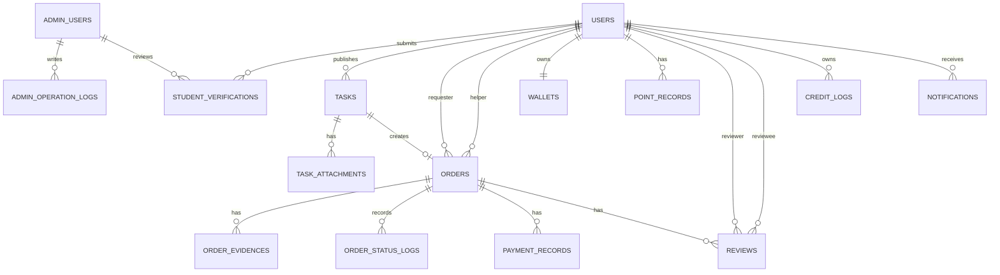

# Campus Helper Phase 3 详细设计文档（整合版）

**团队名称**：哪一队  
**阶段**：Phase 3 详细设计  
**主导负责人**：罗昕雅（架构负责人）  
**日期**：2026-05-17  
**文档版本**：V1.0
**状态**：已经由全部组员审核

---

## 1. 文档目的

本文档是 Campus Helper 校园互助服务平台 Phase 3 的详细设计整合版，基于 P1 需求规格说明书和 P2 架构设计文档完成。本文档覆盖以下内容：

1. 核心类图设计；
2. SOLID 检查清单；
3. 设计模式应用说明；
4. API 规范文档；
5. ER 图与建表 SQL；
6. AI 协作反思日志 #3。

本阶段目标是将 P2 的“前后端分离 + 分层单体架构”进一步细化为可供 P4/P5 编码阶段直接参考的类、接口、数据库表和设计约束。

---

## 2. 设计依据与范围

### 2.1 设计依据

- P1 需求规格说明书：明确 Campus Helper 的核心功能为用户认证、任务发布/接单、订单管理、支付托管、信用评价和后台管理。
- P2 架构设计文档：确定系统采用前后端分离 + 分层单体架构，后端采用 Java 17 + Spring Boot 3.x，数据访问采用 MyBatis-Plus。
- P3 作业要求：完成类图、SOLID 检查、API 规范、数据库设计和 AI 协作反思日志。

### 2.2 本阶段覆盖的 P0 核心功能

| 模块     | 覆盖功能                            |
|--------|---------------------------------|
| 用户认证模块 | 手机号验证码登录、学生证认证、用户信息、信用概览        |
| 任务管理模块 | 发布任务、浏览任务、任务详情、接单、取消任务          |
| 订单管理模块 | 接单生成订单、状态流转、上传凭证、确认完成、取消订单、自动完成 |
| 支付结算模块 | 托管支付、释放报酬、退款、5% 手续费、积分支付        |
| 信用评价模块 | 互评、信用分变化记录、取消扣分、接单限制            |
| 消息通知模块 | 审核结果通知、订单状态通知                   |
| 管理后台模块 | 学生认证审核、用户封禁、订单调整、纠纷处理、敏感词管理     |

### 2.3 暂不纳入本阶段的内容

为了保证 4 人团队在 10 周内可落地，本阶段不设计以下复杂功能：

1. 独立即时通讯系统；
2. 微服务拆分；
3. RabbitMQ 等独立消息队列；
4. 复杂推荐算法；
5. 多校区大规模运营中台。

---

# 3. 类图设计

## 3.1 AI 原始类图问题概述

AI 原始类图覆盖了系统主要对象，但存在以下设计风险：

1. `CampusHelperSystem` 类过于庞大，类似“上帝类”；
2. `User` 实体承担登录、发布任务、接单、评价等过多职责；
3. `UserService`、`OrderService`、`AdminService` 方法过多；
4. `ExpressTask`、`TutorTask` 等任务子类继承结构不稳定；
5. `PaymentService` 直接依赖具体支付实现；
6. 订单状态流转规则没有集中管理。

因此，本设计采用人工修正版类图。

## 3.2 人工修正版核心类图

```mermaid
classDiagram

class User {
  - Long id
  - String phone
  - String nickname
  - String avatarUrl
  - String school
  - String dormitory
  - Integer creditScore
  - Integer completedOrderCount
  - Double goodReviewRate
  - UserStatus status
  - LocalDateTime createdAt
  + isVerified() Boolean
  + isBanned() Boolean
  + canAcceptOrder() Boolean
}

class StudentVerification {
  - Long id
  - Long userId
  - String studentNo
  - String studentCardImageUrl
  - VerificationStatus status
  - Long reviewerId
  - String rejectReason
  - LocalDateTime submittedAt
  - LocalDateTime reviewedAt
  + approve(reviewerId)
  + reject(reviewerId, reason)
}

class AdminUser {
  - Long id
  - String username
  - String passwordHash
  - AdminRole role
  - AdminStatus status
  + hasPermission(permission) Boolean
}

class Task {
  - Long id
  - Long publisherId
  - TaskType type
  - String title
  - String description
  - BigDecimal rewardAmount
  - RewardType rewardType
  - String location
  - LocalDateTime deadline
  - TaskStatus status
  - LocalDateTime createdAt
  + canBeAccepted() Boolean
  + markAccepted()
  + cancel()
}

class TaskAttachment {
  - Long id
  - Long taskId
  - String fileUrl
  - Boolean visibleToHelperOnly
  + isVisibleTo(userId) Boolean
}

class TaskValidationStrategy {
  <<interface>>
  + supports(type) Boolean
  + validate(task, attachments) void
}

class ExpressTaskValidationStrategy {
  + supports(type) Boolean
  + validate(task, attachments) void
}

class DefaultTaskValidationStrategy {
  + supports(type) Boolean
  + validate(task, attachments) void
}

class Order {
  - Long id
  - Long taskId
  - Long requesterId
  - Long helperId
  - OrderStatus status
  - BigDecimal rewardAmount
  - LocalDateTime acceptedAt
  - LocalDateTime completedAt
  + submitEvidence(evidence)
  + confirmComplete()
  + cancel(operatorId, reason)
}

class OrderEvidence {
  - Long id
  - Long orderId
  - Long submitterId
  - String content
  - String imageUrl
  - LocalDateTime submittedAt
}

class OrderStatusLog {
  - Long id
  - Long orderId
  - OrderStatus fromStatus
  - OrderStatus toStatus
  - Long operatorId
  - String reason
  - LocalDateTime createdAt
}

class OrderStatusMachine {
  + canTransit(fromStatus, toStatus) Boolean
  + transit(order, toStatus, operatorId, reason) void
}

class PaymentRecord {
  - Long id
  - Long orderId
  - Long payerId
  - Long payeeId
  - BigDecimal amount
  - BigDecimal feeAmount
  - PaymentType paymentType
  - PaymentStatus status
  - LocalDateTime createdAt
  + markEscrowed()
  + markReleased()
  + markRefunded()
}

class Wallet {
  - Long id
  - Long userId
  - Integer pointBalance
  - BigDecimal frozenAmount
  + freeze(amount)
  + release(amount)
  + refund(amount)
}

class PaymentGateway {
  <<interface>>
  + prepay(order, amount) PaymentResult
  + release(paymentRecord) void
  + refund(paymentRecord) void
}

class WechatPaymentGateway {
  + prepay(order, amount) PaymentResult
  + release(paymentRecord) void
  + refund(paymentRecord) void
}

class PointPaymentGateway {
  + prepay(order, amount) PaymentResult
  + release(paymentRecord) void
  + refund(paymentRecord) void
}

class Review {
  - Long id
  - Long orderId
  - Long reviewerId
  - Long revieweeId
  - Integer rating
  - String content
  - LocalDateTime createdAt
  + isPositive() Boolean
}

class CreditLog {
  - Long id
  - Long userId
  - Integer changeValue
  - CreditChangeReason reason
  - Long relatedOrderId
  - LocalDateTime createdAt
}

class Notification {
  - Long id
  - Long receiverId
  - String title
  - String content
  - Boolean readStatus
  - LocalDateTime createdAt
  + markAsRead()
}

class SensitiveWord {
  - Long id
  - String word
  - String level
  - Boolean enabled
  + isEnabled() Boolean
}

class AuthService {
  + sendSmsCode(phone) void
  + login(phone, code) TokenDTO
  + validateToken(token) UserContext
}

class UserService {
  + getUserInfo(userId) UserDTO
  + updateProfile(userId, request) void
  + getCreditSummary(userId) CreditSummaryDTO
  + checkCanPublish(userId) void
  + checkCanAccept(userId) void
}

class VerificationService {
  + submitStudentCard(userId, request) void
  + reviewVerification(id, reviewerId, result) void
}

class TaskService {
  + publishTask(userId, request) Long
  + listTasks(condition) Page~TaskDTO~
  + getTaskDetail(taskId, viewerId) TaskDetailDTO
  + cancelTask(taskId, operatorId, reason) void
}

class OrderService {
  + acceptTask(taskId, helperId) Long
  + getOrderDetail(orderId, viewerId) OrderDetailDTO
  + uploadEvidence(orderId, helperId, request) void
  + confirmComplete(orderId, requesterId) void
  + cancelOrder(orderId, operatorId, reason) void
  + autoCompleteExpiredOrders() void
}

class PaymentService {
  - PaymentGateway paymentGateway
  + createEscrowPayment(orderId, payerId) PaymentRecord
  + releasePayment(orderId) void
  + refundPayment(orderId) void
}

class CreditService {
  + changeCredit(userId, value, reason, orderId) void
  + handleOrderCancelled(userId, orderId) void
  + isRestrictedFromAccepting(userId) Boolean
}

class ReviewService {
  + submitReview(orderId, reviewerId, request) void
  + listReviewsByUser(userId) List~ReviewDTO~
  + updateUserRating(userId) void
}

class NotificationService {
  + sendOrderStatusNotification(orderId, receiverId) void
  + sendVerificationResult(userId, result) void
}

class SensitiveWordService {
  + checkContent(content) void
  + addWord(word) void
  + disableWord(id) void
}

class AdminUserService {
  + listUsers(condition) Page~UserDTO~
  + banUser(userId, adminId, reason) void
  + adjustCredit(userId, adminId, value, reason) void
}

class AdminOrderService {
  + listOrders(condition) Page~OrderDTO~
  + adjustOrderStatus(orderId, adminId, status, reason) void
  + handleDispute(orderId, adminId, decision) void
}

User "1" --> "0..*" StudentVerification : submits
User "1" --> "0..*" Task : publishes
Task "1" --> "0..*" TaskAttachment : has
Task "1" --> "0..1" Order : creates
Order "*" --> "1" User : requester
Order "*" --> "1" User : helper
Order "1" --> "0..*" OrderEvidence : has
Order "1" --> "0..*" OrderStatusLog : records
Order "1" --> "0..*" PaymentRecord : has
User "1" --> "1" Wallet : owns
Order "1" --> "0..*" Review : has
User "1" --> "0..*" CreditLog : owns
User "1" --> "0..*" Notification : receives

TaskValidationStrategy <|.. ExpressTaskValidationStrategy
TaskValidationStrategy <|.. DefaultTaskValidationStrategy
PaymentGateway <|.. WechatPaymentGateway
PaymentGateway <|.. PointPaymentGateway

TaskService --> TaskValidationStrategy : uses
OrderService --> OrderStatusMachine : uses
OrderService --> PaymentService : coordinates
OrderService --> CreditService : coordinates
OrderService --> NotificationService : coordinates
PaymentService --> PaymentGateway : depends on abstraction
VerificationService --> StudentVerification : manages
ReviewService --> Review : manages
AdminUserService --> UserService : manages users
AdminOrderService --> OrderService : manages orders
SensitiveWordService --> SensitiveWord : manages
```



---

# 4. SOLID 检查清单


| SOLID 原则   | 检查问题                  | AI 设计是否违反 | 违反说明                                                                                                                                                                                | 修正方案                                                                                                                                                                                                                                             |
|------------|-----------------------|-----------|-------------------------------------------------------------------------------------------------------------------------------------------------------------------------------------|--------------------------------------------------------------------------------------------------------------------------------------------------------------------------------------------------------------------------------------------------|
| S - 单一职责原则 | 有没有类承担了过多职责？          | 是         | AI 原始类图中的 `CampusHelperSystem` 同时聚合用户、任务、订单、支付、后台等入口，类似“上帝类”；`User` 类包含登录、发布任务、接单、取消订单、评价等行为；`OrderService` 同时处理订单状态、支付退款、信用扣分、消息通知；`AdminService` 也同时承担登录、用户封禁、订单调整、敏感词管理、数据导出等职责。 | 删除 `CampusHelperSystem` 总控类；`User` 只保留用户属性和少量领域判断方法；将认证、任务、订单、支付、信用、通知、后台管理分别拆入 `AuthService`、`TaskService`、`OrderService`、`PaymentService`、`CreditService`、`NotificationService`、`AdminUserService`、`AdminOrderService`、`SensitiveWordService`。 |
| O - 开闭原则   | 新增需求类型是否需要修改现有代码？     | 是         | AI 原始类图将 `ExpressTask`、`TutorTask`、`SecondHandTask`、`TeamTask` 直接继承自 `Task`。新增任务类型时需要继续增加子类，并且容易修改 `TaskService` 中的类型判断逻辑。订单状态流转也只体现为 `updateOrderStatus()`，新增状态或规则时可能分散修改多个业务方法。   | 保留统一 `Task` 实体，用 `TaskType` 区分类型；不同类型的校验逻辑抽象为 `TaskValidationStrategy`，新增任务类型时新增策略实现类。订单状态流转统一放入 `OrderStatusMachine` 或 `OrderStateTransitionValidator`，新增状态规则时集中维护。                                                                             |
| L - 里氏替换原则 | 子类是否可以替换父类使用？         | 是         | `ExpressTask` 需要取件码，`TutorTask` 需要课程和时长，`TeamTask` 需要成员审批，不同任务子类的必要字段和行为差异较大，不能稳定地无差别替换 `Task` 使用。`AdminUser extends User` 也不合理，因为管理员和普通学生用户的登录入口、权限、业务身份不同。                        | 取消任务类型继承树，改为 `Task + TaskType + TaskValidationStrategy`；取消 `AdminUser extends User`，将 `AdminUser` 作为独立后台账号实体。                                                                                                                                    |
| I - 接口隔离原则 | 有没有接口太“胖”，包含了不需要的方法？  | 是         | `UserService` 同时包含注册、登录、学生证审核、发布任务、接单、提交评价、封禁用户；调用方只需要其中一小部分能力，却被迫依赖过大的服务接口。`AdminService` 也把用户管理、订单管理、信用调整、敏感词维护、数据导出混在一起。                                                         | 拆分为更小的服务接口：`AuthService` 负责登录认证，`VerificationService` 负责学生认证，`UserService` 负责用户资料，`TaskService` 负责任务，`OrderService` 负责订单，`ReviewService` 负责评价，后台再拆为 `AdminUserService`、`AdminOrderService`、`SensitiveWordService`。                               |
| D - 依赖倒转原则 | 高层模块是否直接依赖了低层模块的具体实现？ | 是         | `PaymentService` 直接依赖 `WechatPaymentClient` 和 `PointPaymentClient` 具体类，导致业务层与支付实现耦合。`OrderService` 直接处理退款、信用扣分和通知发送，也会导致高层业务流程依赖过多低层细节。                                             | 抽象 `PaymentGateway` 接口，由 `WechatPaymentGateway` 和 `PointPaymentGateway` 实现；`PaymentService` 依赖接口而不是具体支付类。`OrderService` 只协调 `PaymentService`、`CreditService`、`NotificationService`，具体支付、信用、通知细节由对应服务负责。                                          |

统计结论：AI 原始设计中发现的主要 SOLID 问题数量为 **7 处**。

---

# 5. 设计模式应用

## 5.1 策略模式：任务类型校验

### 应用位置

`TaskValidationStrategy` 及其实现类：

- `ExpressTaskValidationStrategy`
- `DefaultTaskValidationStrategy`
- 后续可扩展 `TutoringTaskValidationStrategy`、`SecondHandTaskValidationStrategy` 等

### 为什么使用

不同任务类型的校验规则不同。例如：

| 任务类型 | 特殊规则                  |
|------|-----------------------|
| 快递代取 | 可能需要取件码图片，并且取件码仅接单方可见 |
| 学习辅导 | 可能需要课程名、预计时长          |
| 二手交易 | 可能需要商品成色、价格说明         |
| 组队   | 可能需要人数上限、活动类型         |

如果所有校验写在 `TaskService.publishTask()` 中，会出现大量 `if-else`，新增任务类型时必须修改已有服务代码，违反开闭原则。

### 如果不用会怎样

- `TaskService` 会不断膨胀；
- 新增任务类型要改旧代码，容易影响已有任务；
- 单元测试难以隔离不同任务类型规则。

---

## 5.2 状态机/状态模式：订单状态流转

### 应用位置

`OrderStatusMachine`

订单状态流转：

```text
ACCEPTED -> IN_PROGRESS -> PENDING_CONFIRM -> COMPLETED
ACCEPTED -> CANCELLED
IN_PROGRESS -> CANCELLED
PENDING_CONFIRM -> COMPLETED
PENDING_CONFIRM -> CANCELLED
```

### 为什么使用

订单状态是系统核心业务规则，不能允许任意修改。例如：

- 已完成订单不能再次取消；
- 未接单任务不能直接确认完成；
- 待确认订单超过 2 天可以由系统自动完成；
- 取消订单要触发信用扣分和退款。

状态机可以把合法流转集中管理，避免规则散落在多个 Service 方法中。

### 如果不用会怎样

- 不同接口可能出现不一致的状态判断；
- 测试难以覆盖所有非法状态跳转；
- 后续增加“申诉中”等状态时修改成本高。

---

## 5.3 网关/适配器思想：支付接口隔离

### 应用位置

`PaymentGateway` 接口及其实现类：

- `WechatPaymentGateway`
- `PointPaymentGateway`

### 为什么使用

订单业务不应该直接依赖微信支付或积分支付的具体实现。通过统一接口隔离后，`PaymentService` 只关心“预支付、打款、退款”，不关心底层支付渠道。

### 如果不用会怎样

- `PaymentService` 里会充满微信支付和积分支付的具体判断；
- 将来新增支付宝或校园卡支付时，需要大量修改旧代码；
- 单元测试必须依赖外部支付细节，不利于 Mock。

---

# 6. API 规范设计

## 6.1 通用响应格式

成功响应：

```json
{
  "code": 200,
  "message": "success",
  "data": {}
}
```

失败响应：

```json
{
  "code": 40001,
  "message": "参数错误：手机号格式不正确",
  "data": null
}
```

## 6.2 通用错误码

|   错误码 | 含义            | 典型场景               |
|------:|---------------|--------------------|
|   200 | 成功            | 请求处理成功             |
| 40001 | 参数错误          | 必填参数为空、格式不合法、金额超限  |
| 40101 | 未登录或 Token 无效 | 未携带 Token、Token 过期 |
| 40301 | 无权限           | 未完成学生认证、被封禁、访问他人订单 |
| 40401 | 资源不存在         | 任务、订单、用户不存在        |
| 40901 | 状态冲突          | 任务已被接单、订单状态不允许当前操作 |
| 42901 | 请求过于频繁        | 验证码发送频率过高          |
| 50001 | 系统内部错误        | 未预期异常              |

## 6.3 核心接口列表

| 模块    | 接口名称    | 方法   | 路径                                     | 认证要求     |
|-------|---------|------|----------------------------------------|----------|
| 用户认证  | 发送验证码   | POST | `/api/auth/sms`                        | 否        |
| 用户认证  | 登录/注册   | POST | `/api/auth/login`                      | 否        |
| 用户认证  | 提交学生证认证 | POST | `/api/auth/student-card`               | 是        |
| 用户信息  | 获取用户信息  | GET  | `/api/user/info`                       | 是        |
| 任务    | 发布任务    | POST | `/api/tasks`                           | 是，需认证通过  |
| 任务    | 浏览任务列表  | GET  | `/api/tasks`                           | 可选       |
| 任务    | 查看任务详情  | GET  | `/api/tasks/{id}`                      | 可选       |
| 任务/订单 | 接单      | POST | `/api/tasks/{id}/accept`               | 是，需认证通过  |
| 订单    | 查看订单详情  | GET  | `/api/orders/{id}`                     | 是，订单相关用户 |
| 订单    | 上传完成凭证  | POST | `/api/orders/{id}/evidence`            | 是，接单方    |
| 订单    | 确认完成    | PUT  | `/api/orders/{id}/confirm`             | 是，需求方    |
| 订单    | 取消订单    | PUT  | `/api/orders/{id}/cancel`              | 是，订单相关用户 |
| 支付    | 创建托管支付  | POST | `/api/orders/{id}/payments`            | 是，需求方    |
| 评价    | 提交评价    | POST | `/api/reviews`                         | 是，订单双方   |
| 管理后台  | 审核学生认证  | PUT  | `/api/admin/verifications/{id}/review` | 是，管理员    |
| 管理后台  | 调整订单状态  | PUT  | `/api/admin/orders/{id}/status`        | 是，管理员    |


---

# 7. 数据库设计

## 7.1 核心实体

| 表名                      | 说明       |
|-------------------------|----------|
| `users`                 | 普通用户表    |
| `student_verifications` | 学生认证申请表  |
| `admin_users`           | 管理员账号表   |
| `tasks`                 | 任务表      |
| `task_attachments`      | 任务附件表    |
| `orders`                | 订单表      |
| `order_evidences`       | 订单完成凭证表  |
| `order_status_logs`     | 订单状态日志表  |
| `payment_records`       | 支付流水表    |
| `wallets`               | 钱包/积分账户表 |
| `point_records`         | 积分流水表    |
| `reviews`               | 评价表      |
| `credit_logs`           | 信用分变动记录表 |
| `notifications`         | 站内通知表    |
| `sensitive_words`       | 敏感词表     |
| `admin_operation_logs`  | 管理员操作日志表 |

## 7.2 ER 图



## 7.3 索引说明摘要

| 表               | 关键索引                                     | 理由              |
|-----------------|------------------------------------------|-----------------|
| `users`         | `phone` 唯一索引                             | 手机号登录           |
| `tasks`         | `status + type + created_at`             | 任务列表按状态、类型、时间筛选 |
| `tasks`         | `reward_amount`                          | 按报酬范围筛选         |
| `orders`        | `task_id` 唯一索引                           | 保证一个任务最多被一人接单   |
| `orders`        | `requester_id + status`                  | 需求方查看订单         |
| `orders`        | `helper_id + status`                     | 接单方查看订单         |
| `orders`        | `status + updated_at`                    | 自动完成超时订单        |
| `reviews`       | `order_id + reviewer_id + reviewee_id`   | 防止重复评价          |
| `credit_logs`   | `user_id + reason + created_at`          | 统计近 30 天取消次数    |
| `notifications` | `receiver_id + read_status + created_at` | 查询用户未读通知        |


---
